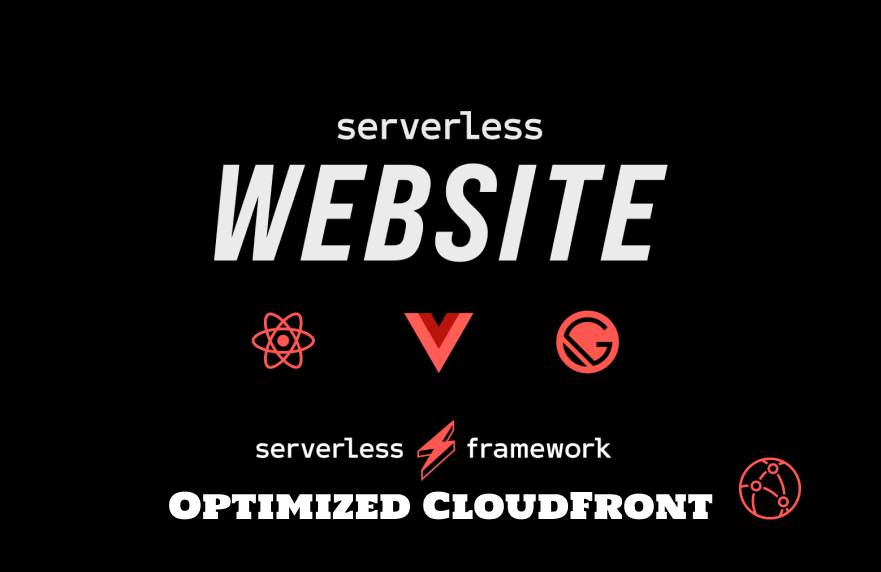
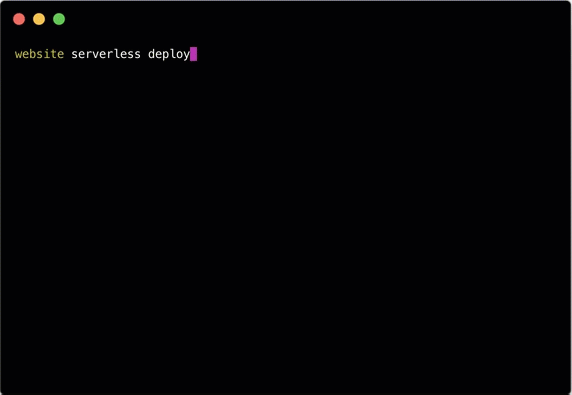

# Serverless Website Component (Optimized CloudFront)

[](http://serverless.com)

<br/>

<p align="center">
  <b>
    This component forked from <a href="https://github.com/serverless-components/website"> serverless-component/website</a>.
  </b>
</p>

<br/>

**Serverless Website Component (Optimized CloudFront)** ⎯⎯⎯ Instantly deploy static website on serverless infrastructure with zero configuration, powered by [Serverless Components](https://github.com/serverless/components).

<br/>

- [x] **Zero Configuration** - Just let us know the component name, then just deploy.
- [x] **Fast Deployments** - Deploy your entire website or frontend in seconds.
- [x] **CDN, SSL & Custom Domains** - Comes with free CDN, SSL & custom domains out of the box.
- [x] **Team Collaboration** - Collaborate with your teammates with shared state and outputs.
- [x] **Built-in Monitoring** - Monitor your website right from the Serverless Dashboard.
- [x] **Cache** - Cache static contents in Browser and CloudFront. **Fastest content load time ~10ms** ⚡️ Optimized CloudFront ⚡️
- [*] **Client Side Routing** - Support Edge Cache even in the situation of client side routing. ⚡️ Optimized Client Side Routing ⚡️

<br/>

Check out the **[Serverless Fullstack Application](https://github.com/serverless-components/fullstack-app)** for a ready-to-use boilerplate and overall great example of how to use this Component.

<br/>



- [**Install**](#install)
- [**Initialize**](#init)
- [**Deploy**](#deploy)
- [**Configure**](#configure)
- [**Dev Mode**](#dev-mode)
- [**Get Info**](#get-info)
- [**Remove**](#remove)
- [**FAQs**](#faqs)

&nbsp;

### Install

To get started with this component, install the latest version of the Serverless Framework:

```
$ npm install -g serverless
```

After installation, make sure you connect your AWS account by setting a provider in the org setting page on the [Serverless Dashboard](https://app.serverless.com).

### Deploy

Once you have the directory set up, you're now ready to deploy. Just run the following command from within the directory containing the `serverless.yml` file:

```
$ serverless deploy
```

Your first deployment might take a little while, but subsequent deployment would just take few seconds. For more information on what's going on during deployment, you could specify the `--debug` flag, which would view deployment logs in realtime:

```
$ serverless deploy --debug
```

### Configure

The Website component is a zero configuration component, meaning that it'll work out of the box with no configuration and sane defaults. With that said, there are still some optional configuration that you can specify.

Here's a complete reference of the `serverless.yml` file for the website component:

```yml
component: website-optimized-cloudfront # (required) name of the component. In that case, it's website.
name: my-website # (required) name of your website component instance.
org: serverlessinc # (optional) serverless dashboard org. default is the first org you created during signup.
app: my-app # (optional) serverless dashboard app. default is the same as the name property.
stage: dev # (optional) serverless dashboard stage. default is dev.

inputs:
  src: ./src # (optional) path to the source folder. default is a hello world html file.
  domain: serverless.com # (optional) domain name. this could also be a subdomain.
  region: us-east-2 # (optional) aws region to deploy to. default is us-east-1.
  bucketName: my-bucket # (optional) aws bucket name. default is an auto generated name.
  indexDocument: index.html # (optional) index document for your website. default is index.html.
  errorDocument: index.html # (optional) error document for your website. default is index.html.
```

You could also provide a build hook to run before the source gets uploaded by turning the `src` input into an object:

```yml
inputs:
  src:
    src: ./src # the input source folder
    hook: npm run build # the hook you want to run
    dist: ./dist # the output dist folder
```

Once you've chosen your configuration, run `serverless deploy` again (or simply just `serverless`) to deploy your changes.

### Dev Mode

Now that you've got your basic website up and running, it's time to develop that into a real world application. Instead of having to run `serverless deploy` everytime you make changes you wanna test, you could enable dev mode, which allows the CLI to watch for changes in your source directory as you develop, and deploy instantly on save.

To enable dev mode, simply run the following command from within the directory containing the `serverless.yml` file:

```
$ serverless dev
```

### Get Info

Anytime you need to know more about your running website instance, you can run the following command to view the most critical info.

```
$ serverless info
```

This is especially helpful when you want to know the outputs of your instances so that you can reference them in another instance. It also shows you the status of your instance, when it was last deployed, and how many times it was deployed. You will also see a url where you'll be able to view more info about your instance on the Serverless Dashboard.

To digg even deeper, you can pass the `--debug` flag to view the state of your component instance in case the deployment failed for any reason.

```
$ serverless info --debug
```

### Remove

If you wanna tear down your entire website infrastructure that was created during deployment, just run the following command in the directory containing the `serverless.yml` file.

```
$ serverless remove
```

The website component will then use all the data it needs from the built-in state storage system to delete only the relavent cloud resources that it created. Just like deployment, you could also specify a `--debug` flag for realtime logs from the website component running in the cloud.

```
$ serverless remove --debug
```
